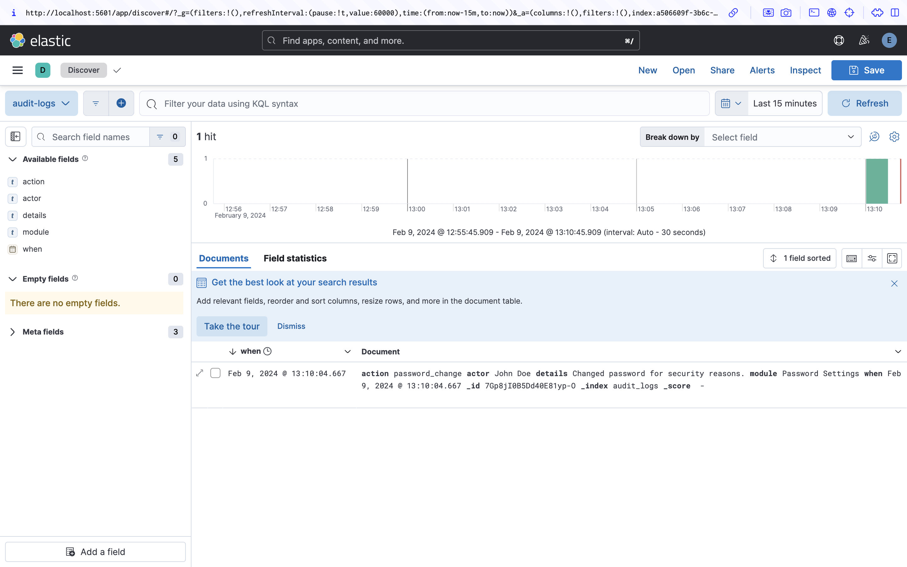

# audit-log-go

## Tech Stack

- Elasticsearch
- Kibana

## Useful Commands

- docker exec -it es01 /usr/share/elasticsearch/bin/elasticsearch-reset-password -u elastic
- docker exec -it es01 /usr/share/elasticsearch/bin/elasticsearch-create-enrollment-token -s kibana

- docker cp es01:/usr/share/elasticsearch/config/certs/http_ca.crt ../cert

## References

- [Building an Audit Log System for a Go Application](https://medium.com/@alameerashraf/building-an-audit-log-system-for-a-go-application-ce131dc21394)
